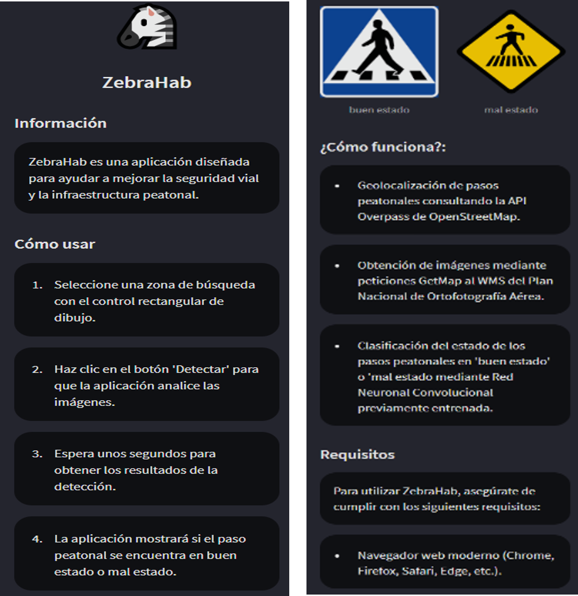
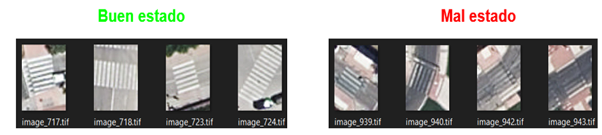

# 🦓 ZebraRehab

**ZebraRehab** es una aplicación desarrollada en Python que utiliza datos de [OpenStreetMap](https://www.openstreetmap.org/), ortofotos del Plan Nacional de Ortofotografía Aérea (PNOA) y una red neuronal convolucional (CNN) para identificar, clasificar y visualizar pasos de peatones en mal estado en la Comunidad Valenciana.


---


---

## 📑 Tabla de contenidos

- [Funcionalidades](#-funcionalidades)
- [Estructura del proyecto](#-estructura-del-proyecto)
- [Capturas de pantalla](#️-capturas-de-pantalla)
- [Instalación](#️-instalación)
- [Ejecución](#️-ejecución)
- [Tecnologías usadas](#-tecnologías-usadas)
- [Notas](#-notas)

---

## 🚀 Funcionalidades

- 🔎 Consulta de datos (pasos de peatones) desde la **Overpass API** (OpenStreetMap)
- 🧩 Creación de regiones de interés (ROIs) a partir de los datos obtenidos
- 🚶 Extracción de imágenes aéreas de los pasos de peatones (**PNOA**)
- 🧠 Clasificación del estado de los pasos de peatones mediante un modelo **CNN** entrenado (test_acc: 70%)
- 🗺️ Visualización de resultados en la región de búsqueda
- 💻 Interfaz interactiva basada en **Streamlit**

---

## 📁 Estructura del proyecto

```
ZebraRehab/
│
├── data/
│   ├── icon/                 
│   ├── model/
│   │   └── CNN.h5            # Modelo de clasificación entrenado
│   └── to_predict/           # Imágenes pendientes de clasificar
│
├── info/
│   ├── __init__.py
│   └── info.py               # Sidebar
│
├── Logica/
│   ├── __init__.py
│   ├── folders.py            # Gestión de carpetas y rutas
│   ├── GetMap.py             # Descarga/obtención de imágenes
│   ├── map.py                # Renderizado del mapa
│   ├── OSM.py                # Consultas a Overpass API / OpenStreetMap
│   ├── predict.py            # Inferencia con el modelo CNN
│   └── ROIs.py               # Extracción de regiones de interés (pasos de peatones)
│
├── misc/                     # Screenshots
├── main.py
├── requirements.txt
└── README.md
```

---

## 🖼️ Capturas de pantalla

### 📖 Instrucciones de uso



### 📍 Regiones de interes (ROIs)


### 🚶 Pasos de peatones detectados


### 📊 Resultados de clasificación


---

## ⚙️ Instalación

```bash
git clone https://github.com/jrvalza/ZebraRehab.git
cd ZebraRehab
pip install -r requirements.txt
```

> 💡 Se recomienda usar un entorno virtual (`venv` o `conda`) para evitar conflictos de dependencias.

```bash
python -m venv venv
source venv/bin/activate    # En Windows: venv\Scripts\activate
pip install -r requirements.txt
```

---

## ▶️ Ejecución

```bash
streamlit run main.py
```

La aplicación se abrirá automáticamente en tu navegador en `http://localhost:8501`.

---

## 🧠 Tecnologías usadas

| Tecnología | Uso |
|---|---|
| 🐍 Python | Lenguaje principal |
| 🎈 Streamlit | Interfaz de usuario |
| 🌐 Requests | Peticiones HTTP a Overpass API |
| 🗺️ PNOA / OpenStreetMap / Overpass API | Fuente de datos geográficos |
| 🧠 TensorFlow / Keras | Modelo CNN para clasificación de pasos de peatones (`CNN.h5`) |

---

## 📌 Notas

- La API de Overpass puede limitar peticiones si se abusa del servicio.
- Se recomienda configurar `timeout` y un `User-Agent` adecuado en las requests.
- Para regiones muy grandes, las consultas pueden tardar más o ser rechazadas por el servidor público de Overpass; considera usar una instancia propia o un mirror alternativo.

